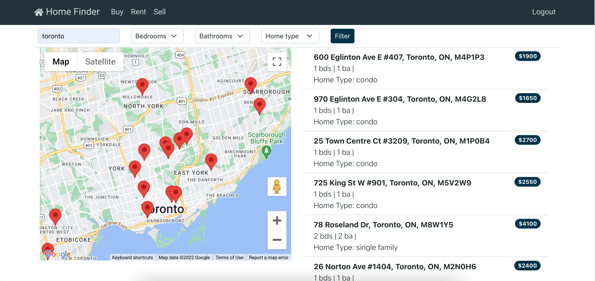
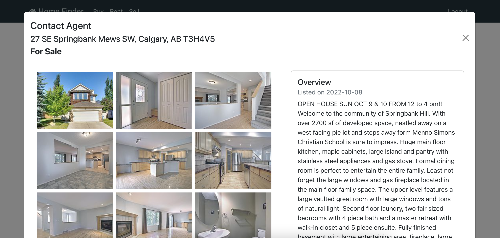

# Home Finder

Home Finder is an app created with Node.js and React that allows users to view homes for sale or rent and to connect with listing agents to their sell existing homes. Twilio and Zillow APIs are used to fetch live data.

## Final Product

### Demo Video

### Listings For Rent

### Listing Details

### Sell Home Page

### Listing Agents

### Agent Profile

Install dependencies with `npm install`.

## Setup

- Set up .env file using .env.example file inside express-back-end directory
  (set up account with Twilio)
- Set up .env file using .env.example file inside react-front-end directory (set up account with firebase, zillow rapid api, google maps api)
- Navigate to express-back-end directory and install dependencies with `npm install`
- Navigate to react-front-end directory and install dependencies with `npm install`
- Once dependencies are installed, open 2 terminals and run following command from root directory of express-back-end and react-front-end `npm start`
- Go to localhost:3030

## Project Stack

- Front-End: React, Axios, JSX, HTML, SASS, JavaScript, Bootstrap

- Back-End: Express, Node.js, Firebase

- API: Zillow, Google Map, Twilio

## Dependencies

- React
- React-dom
- React-scripts
- Axios
- React Bootstrap
- Firebase
- Node SASS
- React-router-dom
- UUID
- React Google Maps API
- Dotenv
- Express
- Twilio

## Connect With Us

### Gloria Cheung

[Github](https://github.com/gloria-cheung) -- [Linkedin](http://www.linkedin.com/in/gloria-cheung) -- [Portfolio](http://www.gloria-cheung.com)

### Brian Nguyen
[Github](https://github.com/brianguyen97) -- [Linkedin](http://www.linkedin.com/in/) 
